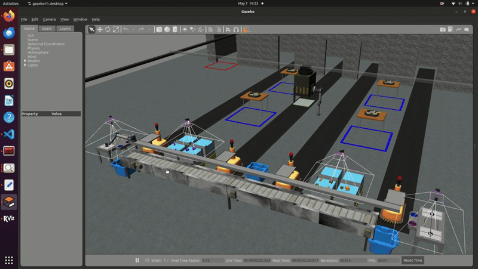

# Agile Robotics for Industrial Automation Competition
The ARIAC (Agile Robotics for Industrial Automation Competition) , hosted by the National Institute of Standards and Technology (NIST), presents a rigorous platform for testing the agility and adaptability of robotic systems in dynamic manufacturing environments. This annual competition challenges participants to develop innovative solutions capable of performing a series of tasks, including pick-and-place operations, assembly, and kitting, within a simulated warehouse setting. More information about ARIAC can be found on Official ARIAC Website
# Team members
*****Team Members*****
1. Aryan Mishra- 120106521
2. Gautam Sreenarayanan Nair - 119543092
3. Hitesh Kyatham - 120275364
4. Keyur Borad - 120426049
5. Sarin Ann Mathew - 119390382
**************************************

# Overview
Our project explores and addresses the core challenges posed by ARIAC, particularly focusing on the kitting task. Kitting involves the systematic gathering and arrangement of parts required for assembly processes. In our approach, we aim to develop a Competitor Control System (CCS) that performs the entire kitting process with precision and adaptability.

Our project addresses specific agility challenges inherent in the ARIAC competition.

High-Priority Order
Insufficient Parts
Correct Gripper
Faulty Parts
Faulty Gripper
By developing a robust robotics software system, our project aims to streamline the kitting process, ensuring seamless task execution while tackling the agility challenges in dynamic manufacturing environments. Through this endeavor, we seek to contribute to the advancement of agile robotics solutions, with potential applications across diverse industrial settings.

# Dependencies
1. Ubuntu 20.04
2. VsCode
3. ROS2 - Galactic
4. Gazebo 11 Classic
5. MoveIt
6. Rviz

### Installing dependencies
```
sudo apt install python3-rosdep
sudo apt install openjdk-17-jdk
sudo rosdep init
rosdep update --include-eol-distros
rosdep install --from-paths src -y --ignore-src
```
**************************************
### Python Libraries

YOLO V8 MODEL
```
pip install ultralytics
```
OPEN CV - CONTRIB
```
pip install opencv-contrib-python
```
### NOTE: If facing any error pertaining to OpenCV, install OpenCV using below command.
OPEN CV
```
pip install opencv-python
```

# Instructions to run the simualtion
- Make sure to have ROS2 Galactic installed on your system.
- Make a workspace by creating a folder named **ariac_ws**. Inside this folder create a folder called **src**. Clone the ariac package inside this workspace using below commands.
```bash
    cd ariac_ws
    git clone -b ariac2023 https://github.com/usnistgov/ARIAC.git src/ariac
```
- For any installation issues regarding moveit and rviz, please refer the official ARIAC website mentioned in the introduction
- Clone the package to the ariac workspace / copy the folder final_group1 into ariac_ws/src. Also make sure robot_commander_msgs folder is present with final_group1 in workspace src folder. Use commands below
```bash
    # In terminal 1
    cd ariac_ws/src
    git clone git@github.com:keyurborad5/ARIAC_group-2.git
```

- Add the `final_spring2024.yaml` file on your ariac_ws folder
- Build the workspace and source using following commands
```bash
    # Install YOLO library
    sudo pip install ultralytics
    # Source underlay
    source /opt/ros/galactic/setup.bash
    # Move to ariac directory
    cd ariac_ws 
    # To install all the dependencies
    rosdep install --from-paths src -y --ignore-src
    # Build all packages i.e. ariac and rwa because '.yaml' file has 
    # been added to ariac and a new package of rwa needs to be built.
    colcon build 
    # Source the workspace (overlay)
    source install/setup.bash
```
### Submission Package Details
This package uses the implementation of BLC Basic Logial Camera in the object detection pipeline.

### NOTE: If there is any issue while building, try building robot_commander_msgs package first. 
**************************************
### Instructions to run
### NOTE: 
This package contains a model trained using YOLO for object detection. The model "aryanbest.pt" is present in "/.../final_group_2/include/aryanbest.pt"
After placing the submitted package in your ROS2 workspace, navigate to "/.../final_group_2/final_group_2/Ap_sensor_sub_interface.py". 
Change the path of the trained model "aryanbest.pt" in Line 94 of the file "Ap_sensor_sub_interface.py" as per your system.
- Ariac Running with Basic Logical Cameras
    ### Terminal 1
    ```bash
      ros2 launch ariac_gazebo ariac.launch.py competitor_pkg:=final_group_2 sensor_config:=my_sensors trial_name:=final_spring2024
    ```
    `Note`: Run the Command in terminal two after the statement `"You can now start the competetion!"` in Terminal 1.
    ### Terminal 2
    ```bash
      ros2 launch ariac_moveit_config ariac_robots_moveit.launch.py rviz:=true
    ```
    ### Terminal 3
    ```bash
        ros2 launch final_group_2 final.launch.py
## Resources:
1. [https://pages.nist.gov/ARIAC_docs/en/latest/index.html](https://pages.nist.gov/ARIAC_docs/en/latest/index.html)
2. [ROS Galactic](https://docs.ros.org/en/galactic/index.html)
    ```


   
